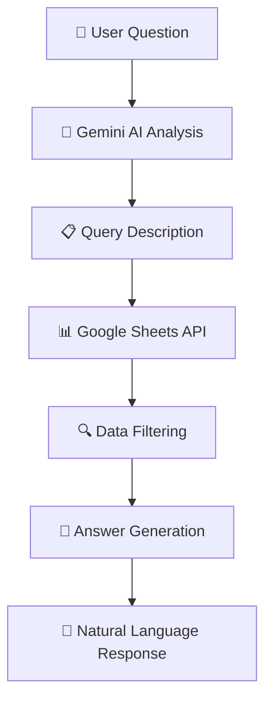

# 🤖📊 Gemini Sheets Chat

**Chat with your Google Sheets using natural language powered by Google's Gemini AI!**

[](https://dotnet.microsoft.com/)
[](https://developers.google.com/sheets/api)
[](https://learn.microsoft.com/en-us/semantic-kernel/)

> Transform your spreadsheet data into conversational insights! Ask questions about your Google Sheets data in plain English and get intelligent responses powered by Google's Gemini AI.

## ✨ Features

🔍 **Natural Language Queries** - Ask questions like "Who are the engineers?" or "What's the average salary in Sales?"

🤖 **AI-Powered Analysis** - Leverages Google's Gemini 1.5 Flash for intelligent data interpretation

📊 **Two-Step RAG Pipeline** - Ensures AI answers are grounded in real data from your Google Sheets

🔧 **Auto-Setup** - Automatically creates and populates sample data in your Google Sheets

🛡️ **Secure Authentication** - Uses Google Cloud service account authentication

⚡ **Real-time Processing** - Instant responses with live Google Sheets data

🔄 **Cloud-Based** - Shareable data via Google Sheets with immediate updates

## 🎯 How It Works

The application follows a simple, two-step RAG (Retrieval-Augmented Generation) pattern:



1. **Step 1: Query Analysis** - Converts your question into a filtering strategy using your sheet schema
2. **Step 2: Data Retrieval & Response** - Filters the data and generates a friendly, natural language answer

## 🚀 Demo

Here's what a typical session looks like:

```bash
✓ Google Sheet 'Employees' populated with sample data.

Google Sheets Schema:
Sheet Name: Employees
Columns:
- A: Id (INTEGER) - Employee ID number
- B: Name (TEXT) - Employee full name  
- C: Department (TEXT) - Department (Engineering, Sales, HR)
- D: Salary (INTEGER) - Annual salary in USD
- E: HireDate (TEXT) - Date hired (YYYY-MM-DD format)

Chat with your Google Sheet! Type 'exit' to quit.

> Who are the engineers?

🧠 Query Logic: Filter employees where Department column contains 'Engineering' and return their names.
📊 Sheet Result:
Id	Name	Department	Salary	HireDate
1	Alice Johnson	Engineering	95000	2022-01-15
3	Charlie Brown	Engineering	110000	2020-05-20

💬 Answer: The engineers are Alice Johnson and Charlie Brown.

> What is the average salary in the Sales department?

🧠 Query Logic: Filter employees where Department is 'Sales' and calculate average of Salary column.
📊 Sheet Result:
Id	Name	Department	Salary	HireDate
2	Bob Smith	Sales	82000	2021-11-30
4	Diana Prince	Sales	78000	2022-08-01

💬 Answer: The average salary for the Sales department is $80,000.
```

## 🛠️ Prerequisites

Before you begin, ensure you have:

- [.NET 9 SDK](https://dotnet.microsoft.com/download/dotnet/9.0)
- [Google AI Studio API Key](https://aistudio.google.com/)
- Google Cloud Project with Sheets API enabled
- Service Account JSON credentials

## ⚡ Quick Start

### 1. Clone and Setup

```bash
git clone https://github.com/donpotts/GeminiSheetsChat.git
cd GeminiSheetsChat
dotnet restore
```

### 2. Configure Gemini API

```bash
dotnet user-secrets init
dotnet user-secrets set "GEMINI_API_KEY" "your-gemini-api-key-here"
```

### 3. Configure Google Spreadsheet ID

```bash
dotnet user-secrets set "GOOGLE_SPREADSHEET_ID" "your-spreadsheet-id-here"
```

### 4. Setup Google Sheets API

1. **Create Google Cloud Project**
   - Go to [Google Cloud Console](https://console.cloud.google.com/)
   - Create project and enable Google Sheets API

2. **Create Service Account**
   - Go to APIs & Services > Credentials
   - Create Service Account and download JSON key
   - Rename to `geminisheetschat.json` and place in project directory

3. **Setup Google Sheet**
   - Create a new Google Sheet
   - Copy the Spreadsheet ID from URL
   - Share with service account email (from JSON file)
   - Grant "Editor" permissions

### 5. Configure Application

No additional configuration needed! The spreadsheet ID is now managed through user secrets for security.

### 6. Run

```bash
dotnet run
```

## 💬 Example Queries

Try these natural language questions:

- 🔍 **Department Queries**: "Who are the engineers?", "Show me the Sales team"
- 💰 **Salary Analysis**: "Who earns more than $90,000?", "What's the average salary?"
- 📅 **Date Filtering**: "Who was hired in 2022?", "Show recent hires"
- 📊 **Statistics**: "How many people work in HR?", "What's the highest salary?"
- 👥 **General**: "List all employees", "Show me everyone"

## 🏗️ Architecture & Technology Stack

### Core Technologies

| Component | Technology | Purpose |
|-----------|------------|---------|
| **AI Framework** | Microsoft Semantic Kernel 1.64.0 | AI orchestration and prompt management |
| **Language Model** | Google Gemini 1.5 Flash | Natural language understanding and generation |
| **Data Source** | Google Sheets API v4 | Cloud-based spreadsheet integration |
| **Runtime** | .NET 9.0 | Modern, high-performance application platform |
| **Authentication** | Google Cloud Service Account | Secure API access |

### Key Components

- **Semantic Kernel**: Microsoft's AI orchestration framework for building AI applications
- **Google Gemini**: Advanced language model for query understanding and response generation
- **Google Sheets API**: Direct integration with Google Sheets for real-time data access
- **Smart Filtering**: Context-aware data filtering based on AI analysis

## 🔧 Customization

### Switching Gemini Models

```csharp
builder.AddGoogleAIGeminiChatCompletion(
    modelId: "gemini-1.5-pro", // More capable but slower
    // or "gemini-1.5-flash", // Faster and more cost-effective
    apiKey: apiKey
);
```

### Adding Custom Query Types

Extend `FilterDataBasedOnQuery` method:

```csharp
// Example: Age-based filtering
else if (query.Contains("age") && query.Contains("older than"))
{
    // Extract age threshold from query
    var ageMatches = Regex.Matches(query, @"\d+");
    if (ageMatches.Count > 0 && int.TryParse(ageMatches[0].Value, out int ageThreshold))
    {
        // Implement age filtering logic
        includeRow = CalculateAge(row[5]?.ToString()) > ageThreshold;
    }
}
```

### Custom Data Schema

1. Update sample data in `SetupGoogleSheet`
2. Modify `GetSheetSchema()` description
3. Adjust data range in `ExecuteSheetQueryAndFormatResults`
4. Update filtering logic as needed

## 📊 Sample Data Structure

The application creates this sample employee dataset:

| Id | Name | Department | Salary | HireDate |
|----|------|------------|--------|----------|
| 1 | Alice Johnson | Engineering | $95,000 | 2022-01-15 |
| 2 | Bob Smith | Sales | $82,000 | 2021-11-30 |
| 3 | Charlie Brown | Engineering | $110,000 | 2020-05-20 |
| 4 | Diana Prince | Sales | $78,000 | 2022-08-01 |
| 5 | Eve Adams | HR | $65,000 | 2023-02-10 |

## 🛡️ Security Best Practices

- 🔐 Keep `geminisheetschat.json` secure and never commit to version control
- 📝 Add credential files to `.gitignore`
- 🔑 Use user secrets for API keys in development
- 🌍 Use environment variables for production deployments
- 👥 Grant minimal necessary permissions to service accounts
- 📋 Keep spreadsheet IDs in configuration, not source code

## 🆘 Troubleshooting

### Common Issues & Solutions

| Issue | Solution |
|-------|----------|
| **"GEMINI_API_KEY is not set"** | Run: `dotnet user-secrets set "GEMINI_API_KEY" "your-key"` |
| **"GOOGLE_SPREADSHEET_ID is not set"** | Run: `dotnet user-secrets set "GOOGLE_SPREADSHEET_ID" "your-id"` |
| **"credentials.json not found"** | Download service account JSON from Google Cloud Console |
| **"Unable to parse range"** | Ensure sheet name exists and matches configuration |
| **"The caller does not have permission"** | Share Google Sheet with service account email |
| **Authentication errors** | Verify JSON file location and service account permissions |

### Debug Steps

1. **Verify API Keys**: Check user secrets with `dotnet user-secrets list`
2. **Test Sheet Access**: Ensure service account can access your Google Sheet
3. **Check Logs**: Review console output for specific error messages
4. **Validate JSON**: Ensure service account JSON file is valid

## 🙏 Acknowledgments

- **[Microsoft Semantic Kernel](https://github.com/microsoft/semantic-kernel)** - AI orchestration framework
- **[Google AI](https://ai.google.dev/)** - Gemini language models
- **[Google Sheets API](https://developers.google.com/sheets/api)** - Spreadsheet integration
- **[.NET Foundation](https://dotnetfoundation.org/)** - .NET ecosystem and tools

## ⭐ Show Your Support

If you find this project helpful, please consider:

- ⭐ **Starring this repository**
- 🐛 **Reporting bugs** or suggesting features
- 📢 **Sharing** with others who might benefit

## 📧 Contact

**Don Potts** - [Don.Potts@DonPotts.com](mailto:Don.Potts@DonPotts.com)

---

<div align="center">

**🚀 Transform your spreadsheets into intelligent conversations today! 🚀**

</div>
